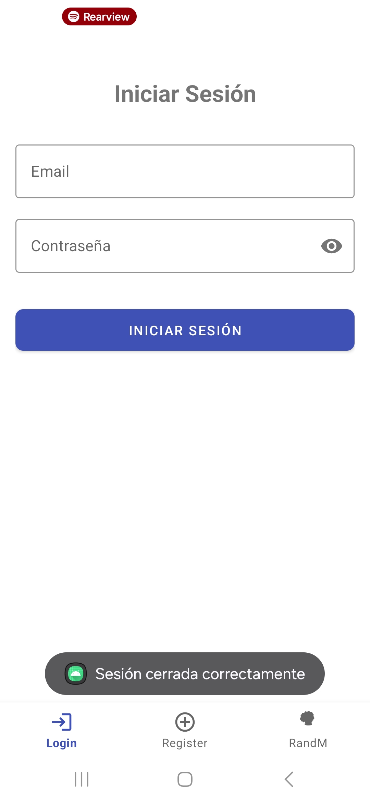
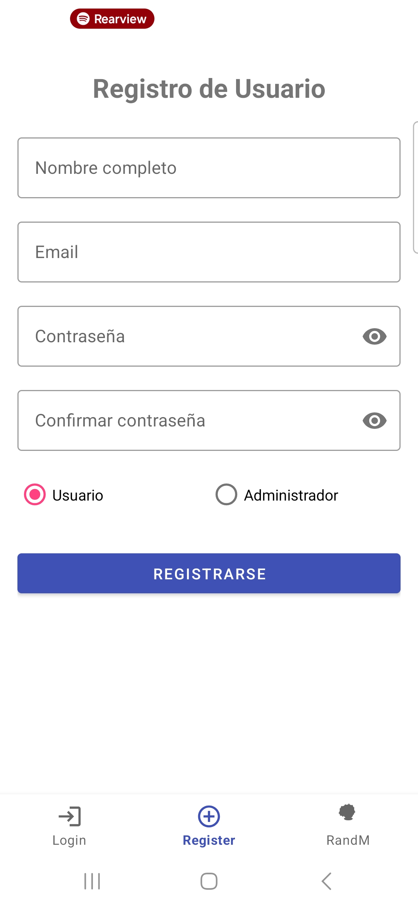
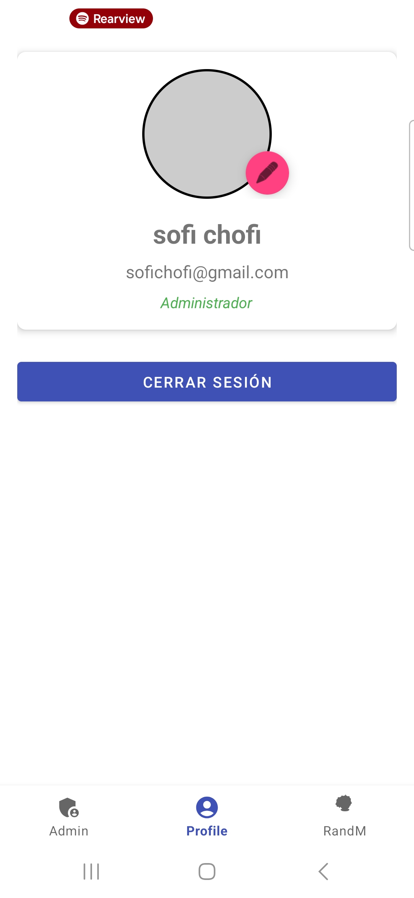
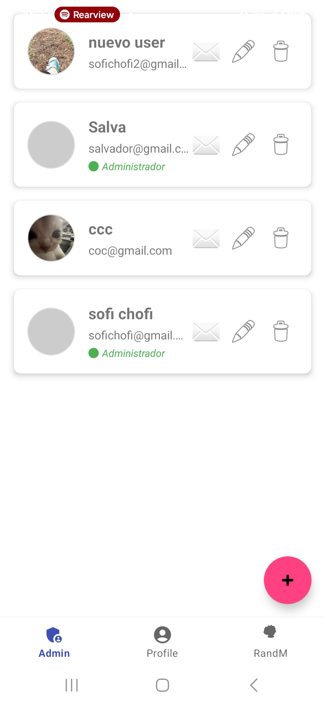
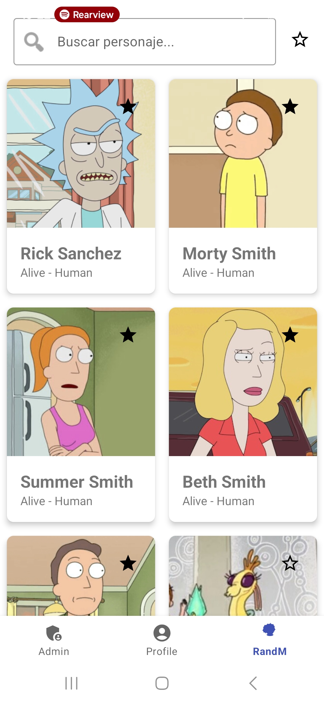

# CRUD Firebase App con Rick and Morty API

Esta aplicación para Android es un sistema completo que demuestra la implementación de funcionalidades CRUD (Crear, Leer, Actualizar, Borrar) para la gestión de usuarios utilizando el stack de Firebase. Adicionalmente, se integra con la API pública de "Rick and Morty" para ofrecer una experiencia de exploración de personajes, permitiendo a los usuarios guardar sus favoritos y ver detalles específicos de cada uno.

El proyecto está desarrollado en Kotlin y sigue una arquitectura moderna MVVM (Model-View-ViewModel) para las funcionalidades más complejas, garantizando un código limpio, escalable y fácil de mantener.

## Índice

1. [Desarrollo](#desarrollo)
2. [Conclusiones](#conclusiones)
3. [Bibliografía](#bibliografía)
## Desarrollo

A continuación se documentan las funcionalidades principales implementadas en el proyecto.

### Autenticación y Gestión de Usuarios (CRUD)

La aplicación utiliza **Firebase Authentication** para gestionar el registro y el inicio de sesión de usuarios a través de correo electrónico y contraseña.

* **Registro de Usuarios:** Permite la creación de nuevas cuentas, incluyendo la validación de contraseñas y la asignación de roles.
* **Inicio de Sesión:** Autentica a los usuarios existentes contra Firebase.
* **Gestión de Sesión:** Se utiliza una clase `SessionManager` para mantener el estado de la sesión del usuario localmente, permitiendo una experiencia fluida al reabrir la aplicación.

<!-- images login and register de folder images -->

### Gestión de Perfil y Roles

Los usuarios se almacenan en **Firebase Realtime Database** con información adicional, como nombre, rol y URL de la foto de perfil.

* **Roles (Admin/Usuario):** La aplicación distingue entre usuarios normales y administradores. Los administradores tienen acceso a un panel especial desde donde pueden ver, editar y eliminar a todos los usuarios del sistema.
* **Edición de Perfil:** Los usuarios pueden editar su nombre y cambiar su foto de perfil. Las imágenes se suben a **Firebase Storage** y la URL se asocia al perfil del usuario en Realtime Database.

### Notificaciones Push con FCM

Los administradores pueden enviar notificaciones push a usuarios específicos a través de  **Firebase Cloud Messaging (FCM)** .

* Se implementó un `SendNotificationFragment` que permite redactar un título y un mensaje.
* La aplicación cliente gestiona la recepción de notificaciones en primer y segundo plano a través de la clase `MyFirebaseMessagingService`.

### Integración con API Externa: Rick and Morty

Esta es una de las funcionalidades clave del proyecto, donde se demuestra la capacidad de consumir una API de terceros y sincronizar un estado específico del usuario (favoritos) con Firebase.

#### Consumo de la API con Retrofit

Se utiliza la librería **Retrofit** para realizar las llamadas HTTP a la API de Rick and Morty (`https://rickandmortyapi.com/`). Se definieron modelos de datos (DTOs) para parsear las respuestas JSON de manera estructurada y una interfaz de API para declarar los endpoints.

#### Arquitectura MVVM y Sincronización con Firebase

Para esta funcionalidad se implementó una arquitectura MVVM (Fragment -> ViewModel -> Repository) para separar responsabilidades y facilitar la gestión del estado.

1. **Repository (`CharacterRepository`):** Es el corazón de la lógica. Esta clase es la única fuente de verdad para los datos de los personajes. Su principal responsabilidad es:
   * Realizar llamadas a la API de Rick and Morty para obtener la lista de personajes.
   * Obtener la lista de IDs de los personajes favoritos del usuario actual desde  **Firebase Realtime Database** , almacenados en la ruta `/users/{userId}/favoriteCharacters/`.
   * **Fusionar ambas fuentes de datos:** Combina la información de la API con los datos de Firebase para construir un modelo de UI (`CharacterUiModel`) que sabe si un personaje es favorito o no. Este modelo es el que se envía a la UI.
2. **ViewModel (`RickAndMortyViewModel`):** Gestiona toda la lógica de la UI y el estado complejo, incluyendo:
   * **Paginación (Scroll Infinito):** Carga nuevos personajes automáticamente a medida que el usuario se desplaza.
   * **Búsqueda en la API:** Implementa una búsqueda con "debounce" (retraso) para consultar directamente la API sin sobrecargarla mientras el usuario escribe.
   * **Filtro de Favoritos:** Mantiene un estado para mostrar solo los personajes marcados como favoritos.
3. **Fragment (`RickAndMortyFragment` y `CharacterDetailFragment`):** Son las vistas, responsables únicamente de observar los datos del ViewModel y reaccionar a las interacciones del usuario (clics, scroll, etc.), delegando toda la lógica al ViewModel.

## Conclusiones

#### Logros Principales

* **Integración Completa de Firebase:** Se logró implementar con éxito un ecosistema funcional utilizando Firebase Authentication, Realtime Database, Cloud Storage y Cloud Messaging.
* **Arquitectura Robusta:** La adopción de MVVM para las funcionalidades complejas permitió un desarrollo más ordenado y una clara separación de responsabilidades, lo que facilita futuras expansiones.
* **Sincronización de Datos Híbrida:** Un logro clave fue la capacidad del `Repository` de actuar como intermediario entre una API externa y la base de datos de Firebase, fusionando los datos para presentar un estado coherente al usuario.
* **Experiencia de Usuario Avanzada:** Se implementaron características complejas como la paginación, la búsqueda con "debounce" y el filtrado en tiempo real, mejorando significativamente la interacción del usuario con la aplicación.

#### Retos Superados

* **Gestión de Estado Complejo:** El mayor reto fue manejar simultáneamente los estados de paginación, búsqueda y filtrado en el `RickAndMortyViewModel` sin que interfirieran entre sí.
* **Operaciones Asíncronas:** Coordinar las llamadas asíncronas a la API de Rick and Morty y a Firebase de manera eficiente fue un desafío que se resolvió utilizando corrutinas de Kotlin (`async`/`await`).
* **Limitaciones de Componentes de UI:** Se encontró y solucionó un error relacionado con el límite de 5 ítems del `BottomNavigationView`, lo que requirió una refactorización de la estructura de navegación para hacerla más escalable y organizada.

## Bibliografía

* Android Developers. (s.f.).  *Guía para desarrolladores de Android* . Recuperado el 12 de junio de 2025, de [https://developer.android.com/guide](https://developer.android.com/guide)
* Axel Fuhrmann. (s.f.).  *The Rick and Morty API* . Recuperado el 12 de junio de 2025, de [https://rickandmortyapi.com](https://rickandmortyapi.com)
* Bump Technologies. (s.f.).  *Glide Documentation* . Recuperado el 12 de junio de 2025, de [https://bumptech.github.io/glide/](https://bumptech.github.io/glide/)
* Firebase. (s.f.).  *Documentación de Firebase* . Recuperado el 12 de junio de 2025, de [https://firebase.google.com/docs](https://firebase.google.com/docs)
* Square. (s.f.).  *Retrofit Documentation* . Recuperado el 12 de junio de 2025, de [https://square.github.io/retrofit/](https://square.github.io/retrofit/)
