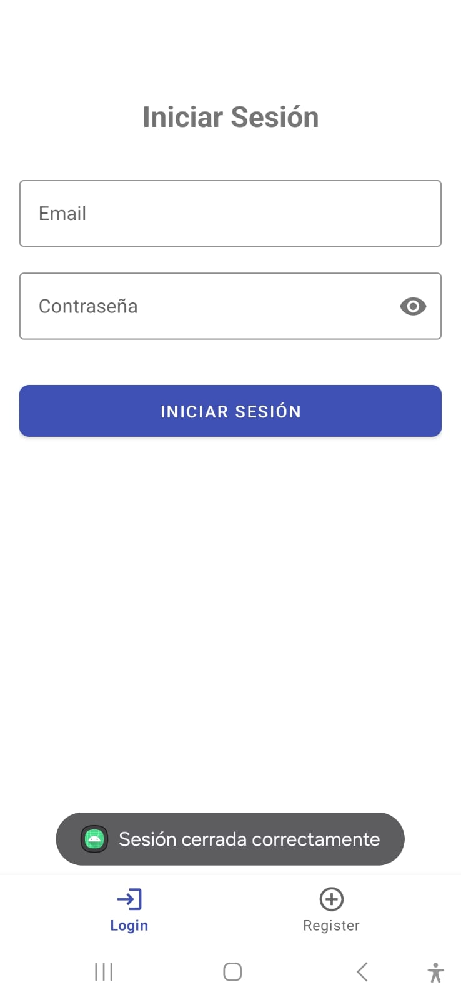
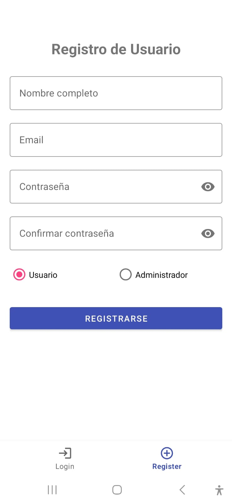
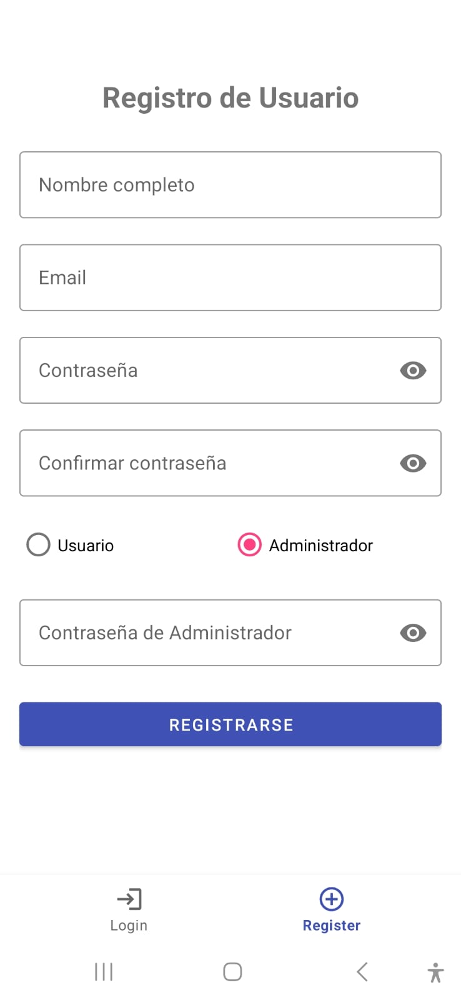
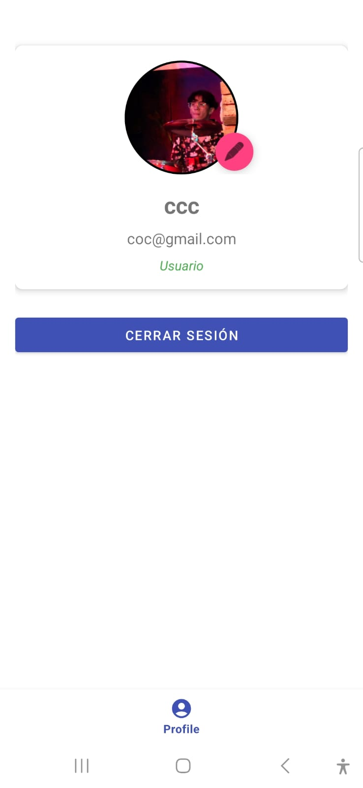
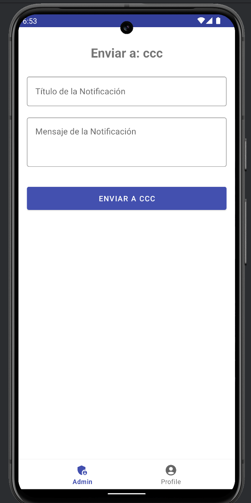
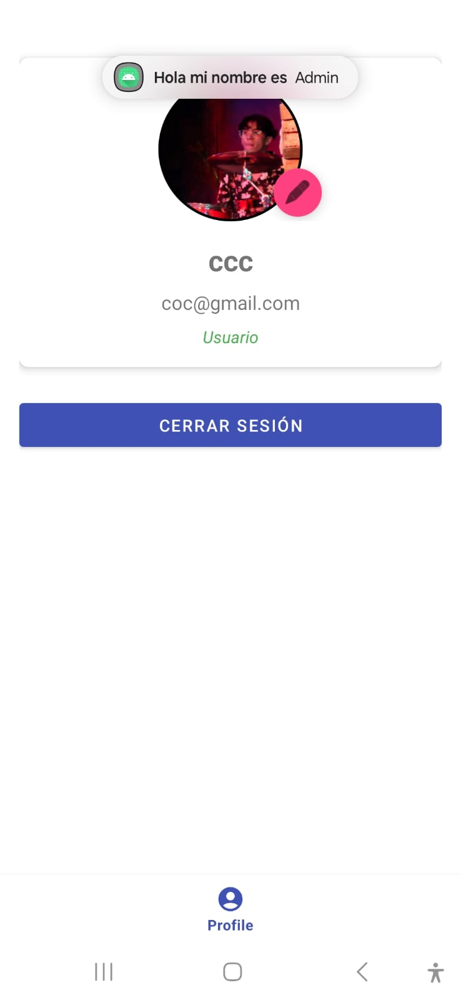

# Proyecto: crudfirebase

## Descripción General

`<span class="selected">crudfirebase</span>` es una aplicación móvil nativa para Android diseñada como una herramienta educativa que implementa un robusto sistema de autenticación de usuarios y gestión de notificaciones push utilizando Firebase. La aplicación permite gestionar dos tipos de usuarios con diferentes niveles de acceso y facilita el envío de notificaciones entre ellos, con un enfoque particular en la capacidad de los administradores para comunicarse con usuarios específicos.

## Características Principales

* **Autenticación de Usuarios:**
  * **Registro e inicio de sesión seguro con Firebase Authentication.**
  * **Gestión de dos roles de usuario: ****Usuario Normal** y  **Administrador** **.**
  * **Protección de la creación de cuentas de administrador mediante una contraseña maestra predefinida.**
  * **Persistencia de sesión para una experiencia de usuario fluida.**
  * **Funcionalidad de cierre de sesión.**
* **Gestión de Usuarios (Administrador):**
  * **Visualización de la lista de todos los usuarios registrados.**
  * **Funcionalidades CRUD (Crear, Leer, Actualizar, Eliminar) para la gestión de usuarios.**
* **Sistema de Notificaciones Push:**
  * **Envío y recepción de notificaciones push a través de Firebase Cloud Messaging (FCM).**
  * **Panel de envío de notificaciones intuitivo para administradores.**
  * **Capacidad para enviar notificaciones a usuarios específicos.**
  * **Visualización de notificaciones recibidas en la aplicación, incluso cuando está en segundo plano o cerrada.**
  * **Historial de notificaciones recibidas para usuarios.**
* **Interfaz de Usuario:**
  * **Diseño intuitivo y funcional adaptado a ambos tipos de usuarios.**
  * **Navegación clara entre las diferentes secciones de la aplicación.**
  * **Diseño responsivo que se adapta a diversos tamaños de pantalla.**

## Requisitos Técnicos Implementados

### Autenticación con Firebase

**La autenticación se implementa utilizando ** **Firebase Authentication** **, permitiendo el registro y el inicio de sesión de usuarios. La información básica de los usuarios, incluyendo su rol (**`<span class="selected">isAdmin</span>`), se almacena en  **Firebase Realtime Database** **.**

**Detalles de Implementación:**

* **Base de Datos:** Se utiliza **Firebase Realtime Database** para almacenar los datos de los usuarios. La estructura de datos es la siguiente:

  ```
  /users
      /{uid_del_usuario}
          createdAt: (timestamp)
          email: (string)
          fcmTokens: (mapa de tokens o lista)
          isAdmin: (boolean)
          name: (string)
          profileImageUrl: (string)
          uid: (string)

  ```

  **Los **`<span class="selected">fcmTokens</span>` se almacenan dentro de cada perfil de usuario para permitir el envío de notificaciones dirigidas.
* **Protección de Cuentas de Administrador:** La creación de cuentas de administrador está protegida por una contraseña maestra. Esta contraseña se define por el desarrollador y se almacena en el archivo `<span class="selected">local.properties</span>` del proyecto Android para evitar que se suba al repositorio de código fuente (ej. GitHub). En la interfaz de registro, un `<span class="selected">RadioButton</span>` activa un campo para introducir esta contraseña maestra, validando el acceso para crear un administrador.
* **Persistencia de Sesión:** La aplicación aprovecha la funcionalidad de persistencia de sesión por defecto proporcionada por Firebase Authentication, lo que permite a los usuarios permanecer conectados incluso después de cerrar la aplicación.

### Notificaciones Push con Firebase Cloud Messaging (FCM)

**El sistema de notificaciones push se configura con ****Firebase Cloud Messaging (FCM)** para el envío y la recepción de mensajes.

**Detalles de Implementación:**

* **Envío de Notificaciones desde el Administrador:**
  * **El envío de notificaciones se realiza a través de ****Cloud Functions** de Firebase. Específicamente, se invoca una función HTTP llamada `<span class="selected">sendHttpPushNotification</span>`.
  * **La aplicación Android utiliza la librería ****Retrofit** para realizar la llamada a esta Cloud Function. Los datos enviados incluyen el token FCM del destinatario (`<span class="selected">to</span>`), el título (`<span class="selected">title</span>`) y el cuerpo (`<span class="selected">body</span>`) de la notificación, encapsulados en un DTO (`<span class="selected">SendMessageDto</span>`).
  * **El administrador puede seleccionar a los destinatarios de forma individual a través de una lista de usuarios en su panel.**
  * **La composición del mensaje está limitada a un título y un cuerpo.**
* **Recepción de Notificaciones:**
  * **La aplicación está configurada para recibir notificaciones incluso cuando se encuentra en segundo plano o está cerrada, siempre y cuando el usuario no haya cerrado la sesión en el dispositivo.**
  * **Se implementa un servicio básico de Android (extendiendo **`<span class="selected">FirebaseMessagingService</span>`) para manejar la recepción de las notificaciones.
  * **Las notificaciones se muestran de forma sencilla en la barra de estado del dispositivo.**
  * **Los tokens FCM de cada dispositivo se guardan en la base de datos de Firebase Realtime Database, asociados a cada usuario, lo que permite el envío de notificaciones dirigidas.**

### Interfaz de Usuario

* **Roles de Usuario:** La interfaz de usuario se adapta al rol del usuario. Los administradores tienen acceso a un fragmento adicional que les proporciona funcionalidades CRUD para la gestión de usuarios y el panel de envío de notificaciones.
* **Navegación:** La navegación entre las diferentes actividades se realiza principalmente utilizando `<span class="selected">Intent</span>`s estándar de Android.
* **Diseño Responsivo:** Se utilizan layouts y componentes estándar de Android que se adaptan automáticamente a diferentes tamaños de pantalla, proporcionando una experiencia de usuario consistente.

## Flujo de Usuario

### Usuario Normal

* **Registro e Inicio de Sesión:** Accede a la aplicación creando una nueva cuenta o iniciando sesión con una existente.
* **Perfil Personal:** Visualiza y edita su información básica.
* **Notificaciones:** Recibe notificaciones push enviadas por los administradores.
* **Historial de Notificaciones:** Accede a una vista donde puede revisar las notificaciones recibidas.

### Administrador

* **Todas las funcionalidades del Usuario Normal.**
* **Gestión de Usuarios:** Visualiza una lista de todos los usuarios registrados y puede realizar operaciones CRUD sobre ellos.
* **Envío de Notificaciones:** Accede a un panel para componer y enviar notificaciones push a usuarios específicos.

## Cómo Ejecutar el Proyecto

1. **Clonar el Repositorio:**
   ```
   git clone <URL_DEL_REPOSITORIO>
   cd crudfirebase

   ```
2. **Configuración de Firebase:**
   * **Crea un proyecto en la consola de Firebase.**
   * **Configura Firebase Authentication (Email/Password).**
   * **Habilita Firebase Realtime Database y configura las reglas de seguridad adecuadas.**
   * **Habilita Firebase Cloud Messaging (FCM).**
   * **Descarga el archivo **`<span class="selected">google-services.json</span>` y colócalo en el directorio `<span class="selected">app/</span>`.
3. **Configuración de Cloud Functions:**
   * **Despliega la función **`<span class="selected">sendHttpPushNotification</span>` en Firebase Cloud Functions. Asegúrate de que la función esté configurada para recibir solicitudes HTTP y de que tenga los permisos necesarios para enviar mensajes FCM.
4. **Contraseña Maestra para Administradores:**
   * **Crea un archivo **`<span class="selected">local.properties</span>` en la raíz de tu proyecto Android (si no existe).
   * **Añade la siguiente línea, reemplazando **`<span class="selected">TU_CONTRASEÑA_MAESTRA</span>` por la contraseña que desees:
     ```
     ADMIN_MASTER_PASSWORD=TU_CONTRASEÑA_MAESTRA

     ```
   * **Asegúrate de que **`<span class="selected">local.properties</span>` esté incluido en tu `<span class="selected">.gitignore</span>` para no subir la contraseña al repositorio.
5. **Abrir en Android Studio:** Abre el proyecto en Android Studio y espera a que Gradle sincronice las dependencias.
6. **Ejecutar la Aplicación:** Ejecuta la aplicación en un emulador o dispositivo físico.

## Capturas de Pantalla

**Aquí se incluirán capturas de pantalla que ilustren las funcionalidades clave de la aplicación.**

* **Pantalla de Inicio de Sesión/Registro:**
<!-- images/iniciosesion.jpeg -->


* **Pantalla de Registro de Administrador (con campo de contraseña maestra):**


* **Perfil de Usuario Normal:**


* **Panel de Administrador (con lista de usuarios y opción de envío de notificaciones):**

* **Composición de Notificación (Administrador):**


* **Notificación Recibida en la Barra de Estado:**



## Capturas de Pantalla

Aquí se incluirán capturas de pantalla que ilustren las funcionalidades clave de la aplicación.

* **Pantalla de Inicio de Sesión/Registro:**
  

  [Image of Login/Register Screen]

* **Pantalla de Registro de Administrador (con campo de contraseña maestra):**
  

  [Image of Admin Registration Screen]

* **Perfil de Usuario Normal:**
  

  [Image of Normal User Profile Screen]

* **Panel de Administrador (con lista de usuarios y opción de envío de notificaciones):**
  

  [Image of Admin Panel Screen]

* **Composición de Notificación (Administrador):**
  

  [Image of Notification Composition Screen]

* **Notificación Recibida en la Barra de Estado:**
  

  [Image of Notification in Status Bar]

* **Historial de Notificaciones (Usuario Normal):**
  

  [Image of Notification History Screen]

## Contribución

**Si deseas contribuir a este proyecto, por favor, sigue los siguientes pasos:**

1. **Haz un fork del repositorio.**
2. **Crea una nueva rama para tus cambios (**`<span class="selected">git checkout -b feature/nueva-funcionalidad</span>`).
3. **Realiza tus cambios y commitea (**`<span class="selected">git commit -m 'feat: Añadir nueva funcionalidad'</span>`).
4. **Sube tus cambios a tu fork (**`<span class="selected">git push origin feature/nueva-funcionalidad</span>`).
5. **Abre un Pull Request.**

## Licencia

**Este proyecto está bajo la Licencia MIT. Consulta el archivo **`<span class="selected">LICENSE</span>` para más detalles.
