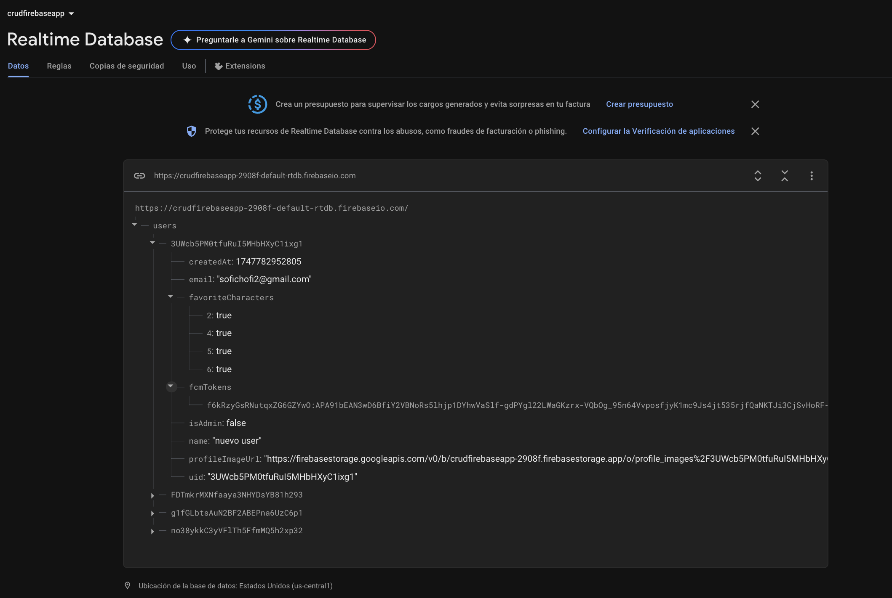
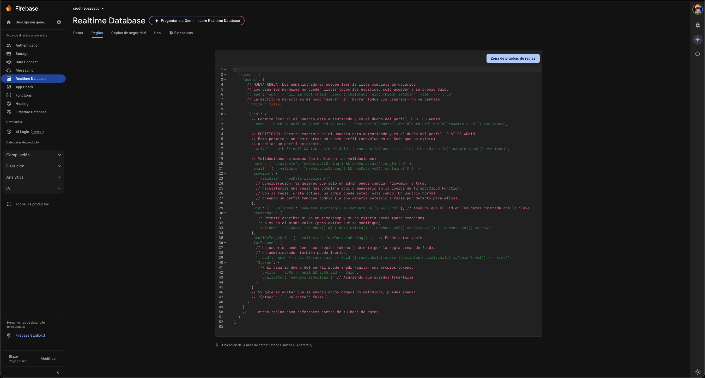
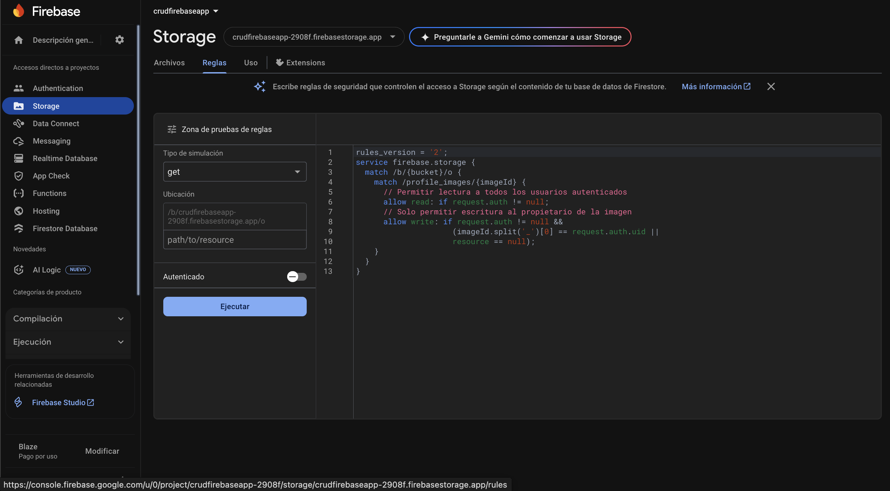
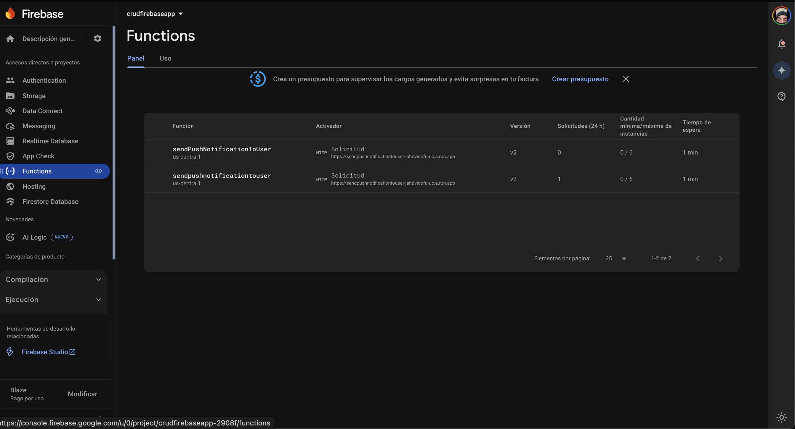

# CRUD Firebase App con Rick and Morty API

Esta aplicación para Android es un sistema completo que demuestra la implementación de funcionalidades CRUD (Crear, Leer, Actualizar, Borrar) para la gestión de usuarios utilizando el stack de Firebase. Adicionalmente, se integra con la API pública de "Rick and Morty" para ofrecer una experiencia de exploración de personajes, permitiendo a los usuarios guardar sus favoritos y ver detalles específicos de cada uno.

El proyecto está desarrollado en Kotlin y sigue una arquitectura moderna MVVM (Model-View-ViewModel) para las funcionalidades más complejas, garantizando un código limpio, escalable y fácil de mantener.

## Índice

1. [Desarrollo](#desarrollo)
2. [Configuración de Firebase](#configuracion-de-firebase)
3. [Conclusiones](#conclusiones)
4. [Bibliografía](#bibliografia)

## Desarrollo

A continuación se documentan las funcionalidades principales implementadas en el proyecto.


### Autenticación y Gestión de Usuarios (CRUD)

La aplicación utiliza **Firebase Authentication** para gestionar el registro y el inicio de sesión de usuarios a través de correo electrónico y contraseña.

* **Registro de Usuarios:** Permite la creación de nuevas cuentas, incluyendo la validación de contraseñas y la asignación de roles.
* **Inicio de Sesión:** Autentica a los usuarios existentes contra Firebase.
* **Gestión de Sesión:** Se utiliza una clase `SessionManager` para mantener el estado de la sesión del usuario localmente, permitiendo una experiencia fluida al reabrir la aplicación.

<!-- images login and register de folder images -->


### Gestión de Perfil y Roles

Los usuarios se almacenan en **Firebase Realtime Database** con información adicional, como nombre, rol y URL de la foto de perfil.

* **Roles (Admin/Usuario):** La aplicación distingue entre usuarios normales y administradores. Los administradores tienen acceso a un panel especial desde donde pueden ver, editar y eliminar a todos los usuarios del sistema.
* **Edición de Perfil:** Los usuarios pueden editar su nombre y cambiar su foto de perfil. Las imágenes se suben a **Firebase Storage** y la URL se asocia al perfil del usuario en Realtime Database.


### Notificaciones Push con FCM

Los administradores pueden enviar notificaciones push a usuarios específicos a través de **Firebase Cloud Messaging (FCM)**.

* Se implementó un `SendNotificationFragment` que permite redactar un título y un mensaje.
* La aplicación cliente gestiona la recepción de notificaciones en primer y segundo plano a través de la clase `MyFirebaseMessagingService`.

### Integración con API Externa: Rick and Morty

Esta es una de las funcionalidades clave del proyecto, donde se demuestra la capacidad de consumir una API de terceros y sincronizar un estado específico del usuario (favoritos) con Firebase.

#### Consumo de la API con Retrofit

Se utiliza la librería **Retrofit** para realizar las llamadas HTTP a la API de Rick and Morty (`https://rickandmortyapi.com/`). Se definieron modelos de datos (DTOs) para parsear las respuestas JSON de manera estructurada y una interfaz de API para declarar los endpoints.

#### Arquitectura MVVM y Sincronización con Firebase

Para esta funcionalidad se implementó una arquitectura MVVM (Fragment -> ViewModel -> Repository) para separar responsabilidades y facilitar la gestión del estado.

1.  **Repository (`CharacterRepository`):** Es el corazón de la lógica. Esta clase es la única fuente de verdad para los datos de los personajes. Su principal responsabilidad es:
    * Realizar llamadas a la API de Rick and Morty para obtener la lista de personajes.
    * Obtener la lista de IDs de los personajes favoritos del usuario actual desde **Firebase Realtime Database**, almacenados en la ruta `/users/{userId}/favoriteCharacters/`.
    * **Fusionar ambas fuentes de datos:** Combina la información de la API con los datos de Firebase para construir un modelo de UI (`CharacterUiModel`) que sabe si un personaje es favorito o no. Este modelo es el que se envía a la UI.
2.  **ViewModel (`RickAndMortyViewModel`):** Gestiona toda la lógica de la UI y el estado complejo, incluyendo:
    * **Paginación (Scroll Infinito):** Carga nuevos personajes automáticamente a medida que el usuario se desplaza.
    * **Búsqueda en la API:** Implementa una búsqueda con "debounce" (retraso) para consultar directamente la API sin sobrecargarla mientras el usuario escribe.
    * **Filtro de Favoritos:** Mantiene un estado para mostrar solo los personajes marcados como favoritos.
3.  **Fragment (`RickAndMortyFragment` y `CharacterDetailFragment`):** Son las vistas, responsables únicamente de observar los datos del ViewModel y reaccionar a las interacciones del usuario (clics, scroll, etc.), delegando toda la lógica al ViewModel.


## Configuración de Firebase

Esta sección detalla cómo se configuraron los servicios de Firebase para soportar la aplicación.

### 1. Base de Datos (Firebase Realtime Database)

La información de los usuarios, incluyendo sus roles, nombres, URLs de imágenes de perfil y los tokens FCM para notificaciones, se almacena en **Firebase Realtime Database**. La estructura de datos está diseñada para facilitar la recuperación y actualización rápida de perfiles de usuario.

* **Estructura de la colección `users`:**
    * Cada usuario se identifica por su `uid` (proporcionado por Firebase Authentication).
    * Dentro de cada `uid`, se almacenan campos como `createdAt`, `email`, `fcmTokens` (un mapa para almacenar múltiples tokens por dispositivo), `isAdmin` (booleano para el rol), `name`, `profileImageUrl` y `uid` nuevamente para referencia.

    


* **Reglas de Seguridad:**
    Las reglas de seguridad de Realtime Database se configuran para asegurar que los usuarios solo puedan leer/escribir su propia información, y que los administradores tengan permisos adecuados para gestionar otros usuarios.

    

* **Reglas para storage:**
    Las reglas de seguridad de Firebase Storage permiten a los usuarios subir y descargar sus propias imágenes de perfil, asegurando que no puedan acceder a las imágenes de otros usuarios.

    

### 2. Notificaciones Push (Firebase Cloud Messaging - FCM)

FCM se utiliza para habilitar el envío de notificaciones push desde el panel de administración a los usuarios de la aplicación.

* **Tokens FCM:** Cuando un usuario inicia sesión en la aplicación, su token de registro de FCM se recupera y se almacena en el nodo `fcmTokens` dentro de su perfil de usuario en Realtime Database. Esto permite al administrador enviar notificaciones dirigidas a dispositivos específicos.

    


* **Cloud Function para Envío de Notificaciones:**
    Para garantizar una comunicación segura y eficiente, el envío de notificaciones desde el administrador de la aplicación cliente (Android) se realiza a través de una **Firebase Cloud Function**. Esta función actúa como intermediario, recibiendo la solicitud del administrador y enviando la notificación a través de la API de FCM.

    **Nombre de la Función:** `sendHttpPushNotification`

    **Código Conceptual de la Cloud Function (JavaScript/Node.js):**
    
    ```javascript
    // Importa las funciones de Firebase
    const functions = require("firebase-functions");
    const admin = require("firebase-admin");

    // Inicializa la app de Firebase (necesario para interactuar con otros servicios como FCM)
    admin.initializeApp();

    // Define la Cloud Function que será invocada vía HTTP
    // Configura la región si es necesario, y ajusta las opciones según tus necesidades.
    exports.sendHttpPushNotification = functions.https.onRequest(async (req, res) => {
      // DEBUG: Log para verificar que la función fue invocada
      console.log("Cloud Function 'sendHttpPushNotification' invocada.");

      // Verificar el método de la solicitud para asegurar que es POST
      if (req.method !== "POST") {
        console.warn("Método no permitido:", req.method);
        return res.status(405).send("Método no permitido. Solo POST.");
      }

      // Extraer los datos del cuerpo de la solicitud JSON
      // Se espera un body como: { "to": "FCM_TOKEN_DEL_USUARIO", "notification": { "title": "...", "body": "..." } }
      const { to, notification } = req.body;

      // Validar que los datos necesarios estén presentes
      if (!to || !notification || !notification.title || !notification.body) {
        console.error("Datos de solicitud incompletos:", req.body);
        return res.status(400).send("Datos de solicitud incompletos. Se requiere 'to', 'notification.title' y 'notification.body'.");
      }

      // Construir el mensaje de la notificación
      const message = {
        token: to, // El token FCM del dispositivo de destino
        notification: {
          title: notification.title,
          body: notification.body,
        },
        // Opcional: puedes añadir data payload para manejar lógica personalizada en la app cliente
        // data: {
        //   key1: "value1",
        //   key2: "value2",
        // },
      };

      try {
        // Enviar la notificación usando el SDK de Firebase Admin
        const response = await admin.messaging().send(message);
        console.log("Notificación enviada exitosamente:", response);
        return res.status(200).send("Notificación enviada exitosamente.");
      } catch (error) {
        console.error("Error al enviar notificación:", error);
        return res.status(500).send("Error al enviar notificación.");
      }
    });
    ```